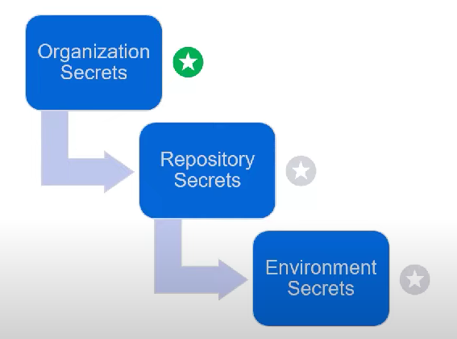

# GitHub Actions Notes

## Agenda

- GitHub actions
- Actions & CI
- CD & Release management
- Self-hosted runners
- Build management
- Package Management
- Secrets Management

## Actions Advantages

- Fully integrated with github
- Respond to any github event(full automation engine)
- Community-powered workflows
- Any platform, any language and any cloud

## Key functionalities

- Can be ran on any systems like Linux, MacOs, Windows and Containers.
- Matrix builds
- Streaming, searchable, linkable logs.
- Built-in secret store.
- Easy to write, easy to share.

## Components of an Action

- How does an Action work?


As you can see from the image above, events trigger the workflows.

 These workflows are set of tasks or actions .

## 1. Events

- First part specified in the yaml. It will be something like,

```yaml
on:
  schedule:
  - cron: 0 12 * * 1
```

- Some other github triggered events:
  - push, pull_request, public
  - Manually triggered:
    - worklfow_dispatch(external systems)

## 2. Workflows

- Workflows are like pipelines in jenkins, teamcity etc.
- Codify useful, customized proccesses.
- .yaml syntax
- .github/workflows (this is where you need to add your workflows folder)

workflow files glue together existing actions in sequence.

- listen for particular events
- Then run pre-existing actions
- or shell scripts

- Actions run in VMs (Linux, Win, Mac)
  - or Docker on Linux vm
- Logs streaming & artifacts
- Secret store with each repo or organization.

## 3. Actions

- Reusable units of code
- Referencing vs authoring actions
- Administrative features
  - It's adviced not to limit actions on the market place, instead, a code review should be done after an actions from marketplace is used.
- Storing shared Actions
  - If you decide to share actions, the repo must be plublic.
- Post your Actions to the GitHub market place.

|             | JavaScript action | Conainter action  |
| :---------: | ----------------- | ----------------- |
| **Virtual Env** | Linux, MacOS, Win | Linux             |
| **Language**    | Anything that compiles to JavaScript | Any |
| **Speed**       | ++                | +                 |
| **User Experience** | ++            | +                 |

## Starter Workflows

- You don't have to create workflows from scractch. Actions provide what we call starter workflows.
- It's treconfigured for specific languages and frameworks.
- Suggested workflows based on language and framework.
- You can create your own workflows.

## Troubleshooting and Best practices

### Troubleshooting tools

- Workflow editor
- Action-debugging (both needs secrets set as true)
  - ACTIONS_STEP_DEBUG (start with these first)
  - ACTIONS_RUNNER_DEBUG
- VS Code extension
- Try locally: nektos/act

### Best Practices

- Versioning
  - Do this so that it doesn't affect users using the previous version.
- Documentation
- Test Coverage
- Maintain metadata

## CI/CD with GitHub Actions

- _CI/CD workflow with GitHub_
- _Actions & CI_
- _Actions, CD & release management_

## Environments

- Logical representation of your environments.
- Dev - Test -QA - PreProd - Prod ...
- Whole environment or "slice"
- Can define their own secrets
- Have protection rules.

## Protection rules

- Required reviewers
- Wait timer
  - can set wait timers before deployment.
- Allowed branches
- APIs for 3 <sup>rd</sup>  party integration

## Deployment logs

- Single or multiple environments
- Complete history of deployment
- Status of deployment

## Runners

| GitHub Hosted       | Self-Hosted |
| :-----------:       | :---------: |
| Automatic updates   | Open source |
| Managed and mainained by GitHub| Automatic updates for self-hosted runnerapplication only |
| clean instance for every job execution| customizable |
| Pricing             | Responsible ofr cost of runner machines |
|                     | **GitHub does not recommend self-hosted runners for public repositories** |

## Configuring Self-Hosted Runners

- Download and extract the scripts.
- configure and authenticate the runner with the token.
- Start listening for jobs.

## Runner groups

- Configure on enterprise and/or organization level.
- Scope to specific organizations and/or repositories.
- Move runners between groups.
- **A runnercan only be in one group at a time**

## Runner Node Configuration

### Best practices

- Create a dedicated user for the actions runner
- Enable limited sudo
- Multiple pools with specific tools

## Securty risks of public runners

Public repositories with self-hosted runners pose potential risks.

- Malicious programs run on the machine
- Escape the machine's runner sandbox
- Expose access to machine's network
- Persist unwanted/dangerous data.

## GitHub Actions Secrets Management

### GitHub Secrets

- GITHUB_TOKEN are secrets that are already part of github.
- **secrets.<"NAME">** are secrets that can be created
- Secrets can be accessed using UI or CLI

## **Difference between Organization and Repository secrets**

| Organization       | Repository |
| :-----------:       | :---------: |
| Allows secret management at org level without duplication  | Scoped to Repository |
| Effectively becomes repo secret| can be used to override org secrets |
| Can be scoped to specific repos|  |
| Not available with the free plan  | Available with the free plan |

## **Environment Secrets**

- Apply to a specific environment
- Override Org ? Repo secrets
- Only users with environment permissions can add / edit

---


## Secrets Limitations

- Secrets cannot be read in apps
  - Actions API does not provide a resource to the encrypted value

- By default, secrets are not passed to workflows triggered by forked repos. You can enable this for private repos.
- Workflows can have up to 100 secrets
- Secrets are limited to 64K in size
  - Use `gpg` to encrypt larger secrets on the repository 

## GitHub Actions API

- Endpoints are available to view anything from the Actions UI
- Artifacts, worklfows, job info, run info
- Secrets API to manage and update your secrets stores